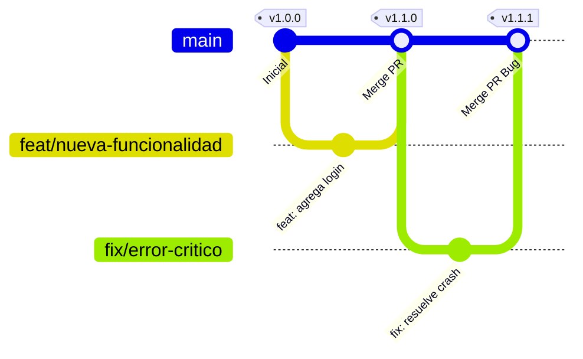

# Proceso de Release

Este proyecto adopta un enfoque basado en [Trunk Based Development](https://dora.dev/capabilities/trunk-based-development/), priorizando la velocidad de despliegue y la entrega de [pequeños cambios de forma continua](https://dora.dev/capabilities/working-in-small-batches/). 

**Consideración básica:** La regla fundamental es que **la rama `main` siempre refleja el estado exacto de producción**.

## Flujo de Ramas y Tags

### Tipos de Ramas
- `main`: Rama principal, estable y persistente. Todo lo que está en `main` es código de producción.
- `feat/*`: Ramas creadas desde `main` para desarrollar nuevas funcionalidades.
- `fix/*`: Ramas creadas desde `main` para corregir errores identificados.

### Esquema de Flujo y Versionado

El siguiente esquema ilustra cómo interactúan las ramas y cómo se generan automáticamente los tags (versiones) al integrar de vuelta a `main`:

### Gestión de Tags
Utilizamos [Semantic Versioning (SemVer)](https://semver.org/lang/es/) para gestionar las versiones del proyecto de forma estructurada.

- El cálculo de la nueva versión se realiza **de forma automática** analizando los mensajes de los commits cada vez que se hace un merge hacia `main`.
- **Requisito clave**: Es obligatorio que los commits incluyan un prefijo estándar (ej. `feat:`, `fix:`) al inicio del mensaje para que el ciclo de versionado semántico funcione.
- Las ramas secundarias validan la estructura de los commits mediante un _linter_. Esta configuración se encuentra en [`commitlint.config.mjs`](../commitlint.config.mjs).

## Workflow de Trabajo

1. **Creación**: Se crea una nueva rama a partir de `main` utilizando los prefijos `feat/` o `fix/`.
2. **Desarrollo**: Se implementa la funcionalidad o corrección. Si es necesario, se puede realizar un despliegue manual al ambiente de desarrollo (`develop`) para pruebas tempranas.
3. **Pull Request (PR)**: Se crea un PR apuntando de vuelta a `main`.
4. **Revisión**: El equipo revisa el código, los pipelines ejecutan sus validaciones de calidad e integración, y finalmente, se hace el merge.
5. **Generación de Tag**: Automáticamente se evalúa el tipo de cambios introducidos y se asocia un nuevo tag (versión) a la rama `main`.
6. **Despliegue a Producción**: El código disponible en el nuevo tag de `main` se despliega a producción. Este paso requiere aprobación manual por seguridad.

> Para más detalles sobre los ambientes y despliegues, consulta [`docs/DEPLOYMENT.md`](./DEPLOYMENT.md).

> **IMPORTANTE**: tanto el `tag` como el `deploy` a produccion se hacen mediante el **trigger** de un commit en la rama `main`. El `tag` no genera un `deploy`.

## Pipelines (GitHub Actions)

La integración y validación continua (CI/CD) se orquesta usando tres flujos principales:

- [`common-lint-version.yml`](../.github/workflows/common-lint-version.yml): Válida que los mensajes de commit sigan las reglas de semántica descritas. Está centralizado para ser reutilizado.
- [`pipeline.yml`](../.github/workflows/pipeline.yml): Encargado del control de calidad. Ejecuta las pruebas unitarias, Linting de código, SAST y validaciones de tipos (Mypy). Estos test no vuelven a correr en la rama `main` para consumir menos recursos y tiempo.
- [`pr-to-main.yml`](../.github/workflows/pr-to-main.yml): Pipeline exclusivo y obligatorio para todos los PRs que apuntan a `main`. Su objetivo es ejecutar los **tests de integración**. Al levantar contenedores y bases de datos reales (PostgreSQL), asegura de forma rigurosa la estabilidad general de la aplicación antes de cualquier cambio en producción.
